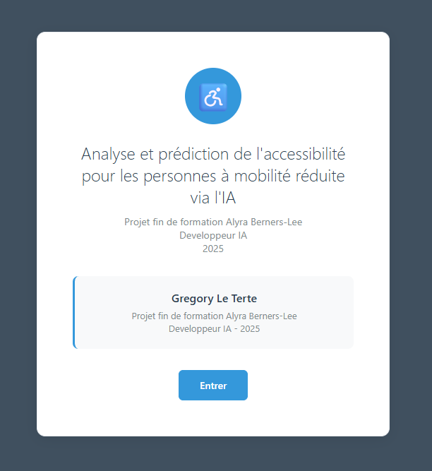

# Projet de Certification - Évaluation de l'Accessibilité PMR

<div align="center">
  
  
  
  
  
</div>

## Description

Ce projet a été développé dans le cadre de la certification RNCP 38616 Développeur IA. Il propose une solution complète pour évaluer l'accessibilité des établissements recevant du public (ERP) pour les personnes à mobilité réduite (PMR) en combinant différentes techniques d'IA :

- **Machine Learning** pour l'analyse des données structurées
- **Deep Learning** avec YOLOv8 pour la détection d'éléments d'accessibilité sur images
- **API REST** pour le déploiement des modèles

## Objectifs

- Automatiser l'évaluation de l'accessibilité PMR des ERP
- Fournir des rapports détaillés sur les critères d'accessibilité
- Proposer des recommandations d'amélioration
- Créer une interface utilisateur intuitive pour les évaluateurs

## Structure du Projet

```
.
├── 1-TravailExploratoireDesDonnées/    # Analyse exploratoire complète des données
│   └── 01_data_exploration.py         # Application Streamlit d'analyse
├── 2-TravailPreparationdesDonnées/    # Nettoyage et préparation des données
│   └── 02_data_preparation.py         # Script de préparation
├── 3-TravailModelisé/                 # Modélisation ML classique
│   └── 03_model_training.py           # Entraînement des modèles ML
├── 5-TravailDL/                      # Approche Deep Learning
│   ├── 01-DL_ok.py                   # Modèle de classification profonde
│   └── 02-Diagnostic_surapprentissage.py  # Analyse du surapprentissage
├── 6-DL-VisionComputer/              # Détection d'objets avec YOLOv8
│   ├── data/                         # Jeu de données d'images
│   ├── models/                       # Modèles entraînés
│   └── scripts/                      # Scripts d'entraînement et d'évaluation
├── 7-Deploiement/                    # API et interface web
│   ├── app_yolov8.py                # API FastAPI
│   ├── static/                      # Fichiers statiques (CSS, JS)
│   └── templates/                   # Templates HTML
└── SourceData/                       # Données brutes initiales
```

## Prérequis Techniques

### Configuration minimale recommandée
- **Système d'exploitation** : Windows 10/11, macOS 10.15+, ou Linux
- **Processeur** : 4 cœurs (8 cœurs recommandés)
- **Mémoire RAM** : 8 Go minimum (16 Go recommandés)
- **Stockage** : 10 Go d'espace libre
- **Carte graphique** : NVIDIA GPU avec 4 Go de VRAM recommandé pour l'entraînement

### Logiciels requis
- Python 3.8 ou supérieur
- pip (gestionnaire de paquets Python)
- Git (pour le contrôle de version)
- Un environnement virtuel (venv, conda, etc.)

## 🚀 Installation

### 1. Cloner le dépôt
```bash
git clone https://github.com/votre-utilisateur/acceslibre-ia.git
cd acceslibre-ia
```

### 2. Configuration de l'environnement

#### Option 1 : Avec venv (recommandé)
```bash
# Création de l'environnement
python -m venv venv

# Activation (Windows)
.\venv\Scripts\activate

# Activation (Linux/Mac)
source venv/bin/activate
```

#### Option 2 : Avec conda
```bash
# Création de l'environnement
conda create -n acceslibre python=3.8
conda activate acceslibre
```

### 3. Installation des dépendances

#### Dépendances principales
```bash
pip install -r requirements.txt
```

#### Pour l'exploration des données (Streamlit)
```bash
pip install streamlit plotly pandas-profiling
```

#### Pour le Deep Learning (YOLOv8)
```bash
pip install -r 6-DL-VisionComputer/requirements.txt
```

#### Pour le déploiement (API FastAPI)
```bash
pip install -r 7-Deploiement/requirements.txt
```

> **Note** : Pour l'entraînement sur GPU, assurez-vous d'avoir installé les bons drivers et CUDA Toolkit.

## Guide d'Utilisation

### 1. Exploration des Données avec Streamlit

L'application Streamlit permet d'explorer et d'analyser le jeu de données d'accessibilité de manière interactive.

#### Lancement
```bash
cd 1-TravailExploratoireDesDonnées
streamlit run "01_data_exploration.py"
```

#### Fonctionnalités principales
- **Tableau de bord interactif** : Vue d'ensemble des données
- **Analyse de complétude** : Taux de remplissage par variable
- **Visualisations** : Histogrammes, boîtes à moustaches, etc.
- **Analyse de corrélation** : Matrice de corrélation interactive
- **Détection des valeurs aberrantes** : Identification des anomalies

> **Accès** : http://localhost:8501

#### Exemples d'utilisation
1. **Pour explorer les distributions** :
   - Sélectionnez une variable dans le menu déroulant
   - Ajustez les filtres selon vos besoins
   
2. **Pour analyser les corrélations** :
   - Naviguez vers l'onglet "Analyse des Corrélations"
   - Identifiez les relations entre les variables
   
3. **Pour détecter les valeurs aberrantes** :
   - Utilisez les graphiques en boîte (boxplots)
   - Filtrez les valeurs extrêmes pour une analyse plus fine

### 2. Préparation des Données

#### Objectif
Nettoyer, transformer et préparer les données brutes pour l'entraînement des modèles.

```bash
cd 2-TravailPreparationdesDonnées
python 02_data_preparation.py
```

**Sorties** :
- `data_prepared_EXPLORATION.csv` : Données nettoyées et préparées
- `reports/` : Rapports de prétraitement

**Durée** : 5-10 minutes

### 3. Modélisation ML Classique

#### Entraînement du modèle
```bash
cd 3-TravailModelisé
python 03_model_training.py
```

**Fonctionnalités** :
- Entraîne un modèle Random Forest optimisé
- Évalue les performances avec différentes métriques
- Génère des visualisations d'importance des variables

**Sorties** :
- `Model_bloc3.pkl` : Modèle entraîné
- `evaluation/` : Métriques et graphiques d'évaluation

**Durée** : 10-15 minutes

### 4. Approche Deep Learning

#### Classification avec Réseaux de Neurones
```bash
cd 5-TravailDL
python 01-DL_ok.py
```

**Fonctionnalités** :
- Entraîne un réseau de neurones profond
- Compare les performances avec le modèle classique
- Analyse du surapprentissage

**Sorties** :
- `Model_DL.pkl` : Modèle de deep learning
- `reports/` : Analyse des performances

**Durée** : 15-30 minutes

### 5. Vision par Ordinateur avec YOLOv8

#### Entraînement du modèle de détection
```bash
cd 6-DL-VisionComputer
python train_yolov8_full.py
```

**Spécifications** :
- Architecture : YOLOv8 (taille à préciser)
- Classes : 5 catégories d'éléments d'accessibilité
- Données : 3 367 images annotées

**⚠️ Attention** : 
- Durée d'entraînement : ~9h sur GPU NVIDIA
- Utilisez le modèle pré-entraîné fourni pour des tests rapides

### 6. Déploiement de l'API

#### Lancement du serveur
```bash
cd 7-Deploiement
python app_yolov8.py
```

**Fonctionnalités de l'API** :
- Endpoint `/predict` : Prédiction d'accessibilité sur une image
- Interface web interactive
- Documentation Swagger intégrée

**Accès** :
- Interface web : http://localhost:8002
- Documentation API : http://localhost:8002/docs

**Arrêt** : Appuyez sur `Ctrl+C` dans le terminal

## Données et Modèles

### Jeu de Données
- **Source** :2 sources différentes de données ont été utilisées :
- **Data Gouv** - AccesLibre - https://www.data.gouv.fr/dataservices/api-acces-libre/
- **Zenodo** - Images - https://zenodo.org/records/6382090

- **Taille** : 592 897 établissements (données tabulaires)
- **Images** : 3 367 images annotées pour YOLOv8


### Modèles Entraînés

| Modèle | Type | Fichier | Métrique Principale |
|--------|------|---------|-------------------|
| Random Forest | ML | `Model_bloc3.pkl` | F1-Score: 0.863 |
| MLP | Deep Learning | `Model_DL.pkl` | Accuracy: XX% |
| YOLOv8 | Vision | `yolov8_accessibility.pt` | mAP@0.5: 0.78 |

## 🛠️ Développement

### Structure du Code
- **Organisation** : Modulaire avec séparation claire des préoccupations
- **Documentation** : Docstrings et commentaires en français - anglais

### Bonnes Pratiques
- Utilisation de Git pour le contrôle de version
- Environnements virtuels pour l'isolation des dépendances


## 📝 Licence

Ce projet est sous licence [MIT](LICENSE).

## 👥 Contributeurs

- **Gregory Le Terte** - Développeur IA - [Profil GitHub](https://github.com/votre-profil)
- **Alyra** - École de la Blockchain - [Site Web](https://alyra.fr)

## 🙏 Remerciements

- Aux formateurs Alyra pour leur accompagnement
- À la communauté open source pour les outils utilisés
- Aux contributeurs des jeux de données utilisés

---

<div align="center">
  <p>Projet réalisé dans le cadre de la certification RNCP 38616 Développeur IA</p>
  <p>Formation Alyra - Promo Berners-Lee 2025</p>
</div>
